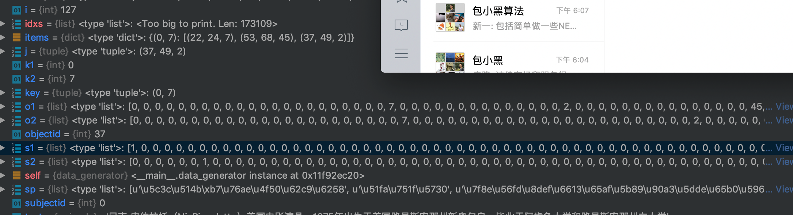

# 2019年百度的三元组抽取比赛
2019年百度的三元组抽取比赛（ http://lic2019.ccf.org.cn/kg ）
## 竞赛任务
给定schema约束集合及句子sent，其中schema定义了关系P以及其对应的主体S和客体O的类别，例如（S_TYPE:人物，P:妻子，O_TYPE:人物）、（S_TYPE:公司，P:创始人，O_TYPE:人物）等。 任务要求参评系统自动地对句子进行分析，输出句子中所有满足schema约束的SPO三元组知识Triples=[(S1, P1, O1), (S2, P2, O2)…]。

输入/输出:\
(1) 输入:schema约束集合及句子sent\
(2) 输出:句子sent中包含的符合给定schema约束的三元组知识Triples

## 方法
主要思路是：\
1、先进行ner任务，提取scheme里面的命名实体；\
2、根据schema约束的三元组规范，返回满足要求的所有可能三元组；\
3、最好有一个验证环节，输入 text，sub，obj；输出 predicate的关系 模型。

之前思路是：先做ner，做的是type级别的识别，识别实体类型，在给定 2实体，做个实体关系的分类，走不通，ner还可以，到了p分类就很差

后面发现没有必要做type级别的ner 只需，标记 Subject 以及 object，带上 predicate

输入：
xxxsssxxxxp1p1p1xxxxp2p2p2xxxx
结构的ner任务就好

后面解码就ok，整个任务其实可以转化为序列标准任务。。。
主要是因为 all_50_schemas 已经定义好了结构，type 啥的都可以知道，之前还在郁闷，type怎么识别。。。-_-

## 数据预处理

###生成 字典集
调用 data.py 中 generate_char_count 方法，再调用 filter_char_dict 按词频过滤字符集，

###生成 ner 标签集
问题 可以转化为 ner任务： 使用 IO  2-tag 格式，也可以其他 tag形式
subject 定位 主体，
predicate 定位 客体与关系
注意 predicate 会有重复的，成立日期 因此需要加上 主体客体类型方便区别定位
标签定义为：
```json
{
  "other": 0,
  "subject": 1,
  "p_祖籍_s_人物_o_地点": 2,
  "p_父亲_s_人物_o_人物": 3,
  "p_总部地点_s_企业_o_地点": 4,
  "p_出生地_s_人物_o_地点": 5,
  "p_目_s_生物_o_目": 6,
  "p_面积_s_行政区_o_Number": 7,
  "p_简称_s_机构_o_Text": 8,
  "p_上映时间_s_影视作品_o_Date": 9,
  "p_妻子_s_人物_o_人物": 10,
  "p_所属专辑_s_歌曲_o_音乐专辑": 11,
  "p_注册资本_s_企业_o_Number": 12,
  "p_首都_s_国家_o_城市": 13,
  "p_导演_s_影视作品_o_人物": 14,
  "p_字_s_历史人物_o_Text": 15,
  "p_身高_s_人物_o_Number": 16,
  "p_出品公司_s_影视作品_o_企业": 17,
  "p_修业年限_s_学科专业_o_Number": 18,
  "p_出生日期_s_人物_o_Date": 19,
  "p_制片人_s_影视作品_o_人物": 20,
  "p_母亲_s_人物_o_人物": 21,
  "p_编剧_s_影视作品_o_人物": 22,
  "p_国籍_s_人物_o_国家": 23,
  "p_海拔_s_地点_o_Number": 24,
  "p_连载网站_s_网络小说_o_网站": 25,
  "p_丈夫_s_人物_o_人物": 26,
  "p_朝代_s_历史人物_o_Text": 27,
  "p_民族_s_人物_o_Text": 28,
  "p_号_s_历史人物_o_Text": 29,
  "p_出版社_s_书籍_o_出版社": 30,
  "p_主持人_s_电视综艺_o_人物": 31,
  "p_专业代码_s_学科专业_o_Text": 32,
  "p_歌手_s_歌曲_o_人物": 33,
  "p_作词_s_歌曲_o_人物": 34,
  "p_主角_s_网络小说_o_人物": 35,
  "p_董事长_s_企业_o_人物": 36,
  "p_成立日期_s_机构_o_Date": 37,
  "p_毕业院校_s_人物_o_学校": 38,
  "p_占地面积_s_机构_o_Number": 39,
  "p_官方语言_s_国家_o_语言": 40,
  "p_邮政编码_s_行政区_o_Text": 41,
  "p_人口数量_s_行政区_o_Number": 42,
  "p_所在城市_s_景点_o_城市": 43,
  "p_作者_s_图书作品_o_人物": 44,
  "p_成立日期_s_企业_o_Date": 45,
  "p_作曲_s_歌曲_o_人物": 46,
  "p_气候_s_行政区_o_气候": 47,
  "p_嘉宾_s_电视综艺_o_人物": 48,
  "p_主演_s_影视作品_o_人物": 49,
  "p_改编自_s_影视作品_o_作品": 50,
  "p_创始人_s_企业_o_人物": 51
}
```

## NER

### ner-1
主要框架为 bilstm+cnn+crf ，搭建ner模型\
char级别

## ner-2
由于比赛的数据及也包含啦分词、词性；因此可以考虑把这些信息也加入起来进行训练
### seg+ner
主要框架为 bilstm+cnn+crf ，训练搭建ner模型\
后面连接3个损失，分别为seg_loss，ner_loss
### seg+pos+ner
主要框架为 bilstm+cnn+crf ，训练搭建ner模型\
后面连接3个损失，分别为seg_loss，pos_loss，ner_loss

multi-label classification




未来实现多个实体


